# μT-Kernel 3.0とNPU/GPUによるリアルタイム画像AI認識

本リポジトリは、ルネサスエレクトロニクス製マイコン **EK-RA8P1**（Cortex-M85 / Ethos-U55 NPU / Dave2D GPU 搭載）と
リアルタイムOS **μT-Kernel 3.0** を用いた、TRONプログラミングコンテスト2026の開発プロジェクトです。

* **コンテスト公式サイト**: [TRONプログラミングコンテスト2026](https://www.tron.org/ja/programming_contest-2026/)

📄 **[English Version (README_en.md)](README_en.md)**

---

## リポジトリのフォルダ構成

本リポジトリは、以下のような構成でソースコードや書き込み用のバイナリが整理されています。

```text
tron-npu/
├── src/                                 (開発ソースコード・e2 studioプロジェクトフォルダ)
│   ├── tron_yolo_face_npu/              (YOLO顔検出 NPU高速版)
│   ├── tron_img_npu/                    (MobileNet画像分類 NPU高速版)
│   ├── tron_edge_fomo_npu_type/         (FOMO部品検出 NPU高速版)
│   └── ...                              (比較用のCPU版や各種基礎ファームウェアプロジェクト)
│
├── debug/                               (実機書き込み用ビルド済みバイナリ・手順書)
├── img/                                 (マニュアル・ドキュメント用画像アセットフォルダ)
├── LICENSE.md                           (ソフトウェアライセンスおよび引用クレジット表記)
└── README.md                            (本ドキュメント)
```

---

## 1. システム概要

本システムは、MIPI-CSI2カメラ（OV5640）からリアルタイムに入力される動画像に対して、物体検出（YOLO-Fastest、FOMO）および画像分類（MobileNet V1）などの深層学習モデルによる推論を実行し、ディスプレイ（1024x600 TFT）へリアルタイムに結果を重ね描きして出力するスマートエッジデバイス・アプリケーションです。

### 「TRON×AI」の親和性
組み込みAIにおける最大の課題は、AI推論（重い行列演算）がCPUパワーを長時間占有してしまい、
画面表示のガクつき（ジッタ）や、センサー監視の取りこぼしを引き起こす点にあります。

本システムでは、μT-Kernel 3.0 の優先度ベースのマルチタスクスケジューリングと、
独立した専用アクセラレータ（NPU/GPU）を組み合わせることで、
**「UI/カメラ表示の応答性（60Hz）の完全維持」** と
**「推論のバックグラウンド実行（数ms〜数十ms）」** の両立を可能とし、
極めて実用的で低遅延なリアルタイムAIエッジアプリケーションを実証しました。

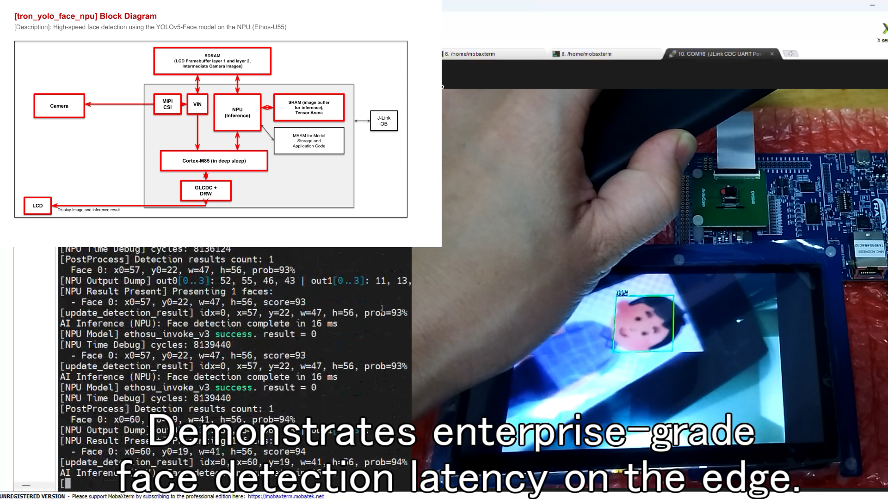

---

## 2. ハードウェア構成

* **MCU / ボード**: ルネサス RA8 シリーズ（EK-RA8P1 / Cortex-M85 480MHz）
* **AIアクセラレータ**: Arm Ethos-U55 NPU（ニューラルネットワーク用）
* **2D GPU**: D/AVE 2D グラフィックスエンジン（画像縮小・ベクトル枠描画用）
* **カメラ**: MIPI-CSI2 接続 OV5640（320x240 RGB565入力）
* **液晶表示**: GLCDC制御 1024x600 TFTカラー液晶パネル
* **外部メモリ**: SDRAM 32MB（トリプルバッファおよびNPUテンソル領域に使用）

##### ハードウェア・ブロック構成:
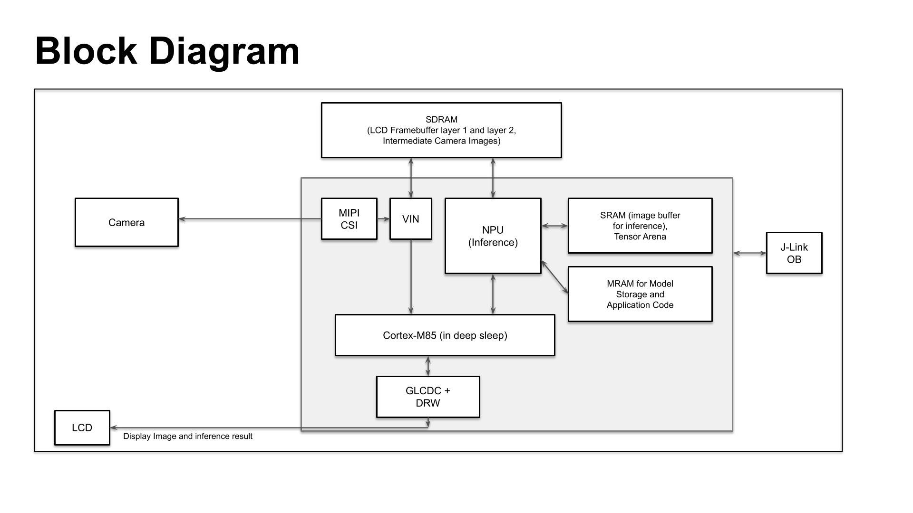

##### EK-RA8P1 評価ボード外観:
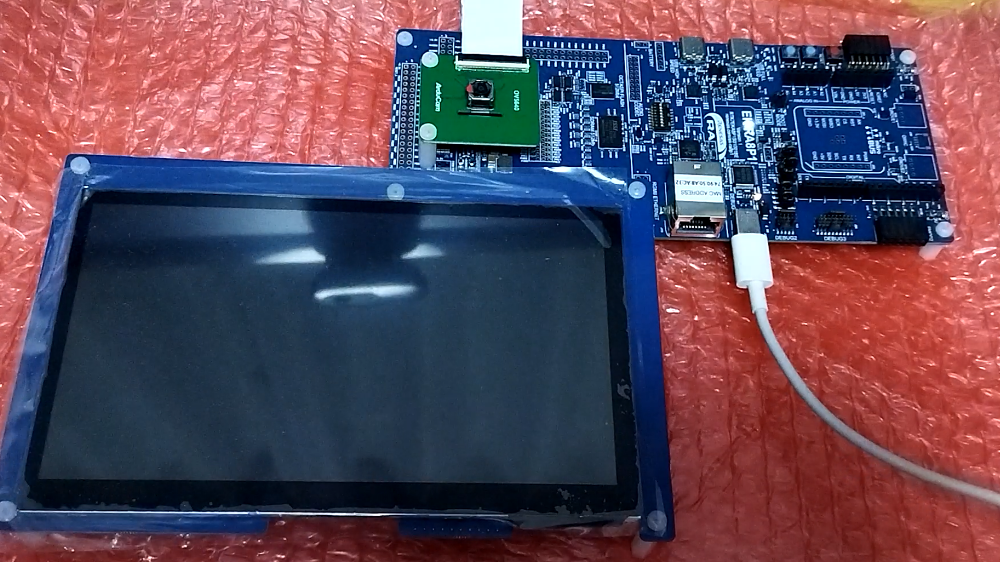


---

## 3. 動作確認方法と開発環境
* **統合開発環境**: e2 studio (Renesas) / FSP v6.5.0 (または FSP v6.4.0)
* **リアルタイムOS**: μT-Kernel 3.0
* **実行環境**: EK-RA8P1 評価ボード
* **ビルドと実行手順**:
  本システムのビルドは e2 studio 上で対象プロジェクトをインポートして行います。
  なお、**実機評価テスト用のビルド済み書き込み用バイナリ（SREC）は、
  すべて [/debug](debug/) フォルダに整理されて配置されています。**

  ツールの入手方法、配線接続、液晶フリーズ対策、デバイスの初期化（アドレスエラー回避）、
  および動作シリアルログ（115200 bps）の確認手順を含む詳細な実行マニュアルは、
  **[/debug/README.md (書き込み手順書)](debug/README.md)** に画像付きで詳しく記載されていますので、
  動作確認の際はそちらをご参照ください。

---

## 4. システムアーキテクチャ

### 5-1. μT-Kernel 3.0 マルチタスク設計（並列駆動）
本システムでは、描画タスクとAI推論タスクをRTOS上で分離し、以下のようにパイプラインで並列動作させます。

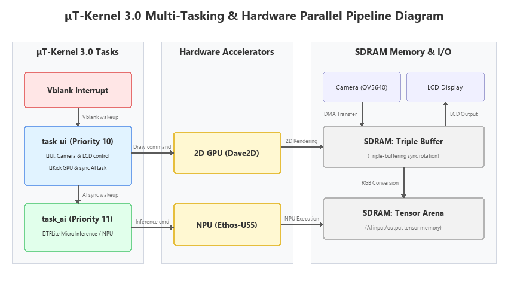

* **UI/カメラタスク (`task_ui` / 優先度10)**:
  カメラ入力画像の取り込み、GLCDC画面切り替え制御、Dave2D (GPU) への描画コマンド発行、顔枠などのバウンディングボックス重ね描きを担当。
* **AI推論タスク (`task_ai` / 優先度11)**:
  TFLite Micro および Ethos-U55 NPU ドライバを介したAI推論の実行を担当。

### 5-2. Dave2D GPU と Ethos-U55 NPU の協調動作シーケンス
液晶の表示更新（60Hz）を一切阻害せずにバックグラウンドでAI推論を並行駆動させるため、マイコン内蔵の2D GPU（Dave2D）とNPUを並列にパイプライン制御する以下のシーケンスを実装しています。

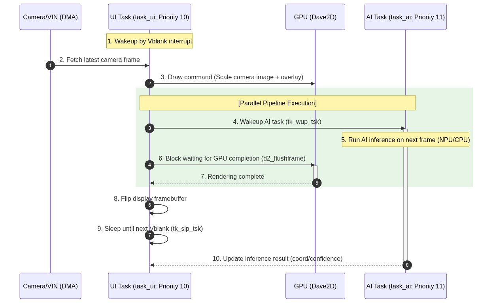

1. **Vblank同期**: UIタスクがVblankの割り込みハンドラから起床 (`tk_wup_tsk`)。
2. **描画コマンド発行**: カメラ画像を取得し、GPUへ「拡大コピー命令」「前フレームの検出枠描画命令」をキューイング。
3. **AIタスク起動**: GPUの処理待ちに入る「前」に、AIタスクへ起床通知 (`tk_wup_tsk(tskid_ai)`)。
4. **ハードウェア並列動作**: AIタスクがNPUに推論を指示し、**「GPUが描画を実行している」のと同時に「NPUが推論を実行している」状態**が生まれます。
5. **Vsyncフリップ**: GPUの完了を待ち (`d2_flushframe`)、液晶バッファを反転（フリップ）してタスクは次のフレームまでスリープします。

これにより、CPU負荷を最小に抑えたまま、60Hzでのチラつきのない滑らかなカメラ映像と、ミリ秒オーダーの超リアルタイムなAI検出表示を完全に並列化しています。

### 5-3. CPUからNPUへのAI推論高速化（リアルタイム性能と決定論的制御）
本プロジェクトでは、NPUによる処理能力を客観的に評価するため、**NPUアクセラレータを使用せずにCortex-M85 CPU単体（TFLite Micro CPU実行）で推論を行う「CPU版プログラム」も並行して開発・ビルドし、実機上での詳細なベンチマーク測定を実施しました。**

これにより、重いAI推論処理をマイコン内蔵の専用アクセラレータ（NPU）へオフロードすることで、
CPU単体での演算実行時に比べて圧倒的なリアルタイム性能向上を達成していることを証明しました。

NPUへの処理委託によってCPU負荷がほぼゼロになり、RTOSのスレッドスケジュール機能が活き、
決定論的なリアルタイム制御を極めて容易に実現できます。

* **実機測定によるNPU高速化ベンチマーク効果 (CPU実行 vs NPU実行)**:
  * **MobileNet V1 画像分類**: CPU上で約1.5秒（1,512ms）かかっていた推論を **約 17 ms（約88.9倍の高速化）** に短縮。
  * **YOLO顔検出**: CPU上で約2秒（2,090ms）要していた推論時間を、NPUを用いることで **約 16 ms（約130.6倍の高速化）** に短縮。
  * **FOMO部品検出**: CPU上の 278 ms から **約 5 ms（約55.6倍の高速化）** へと短縮。

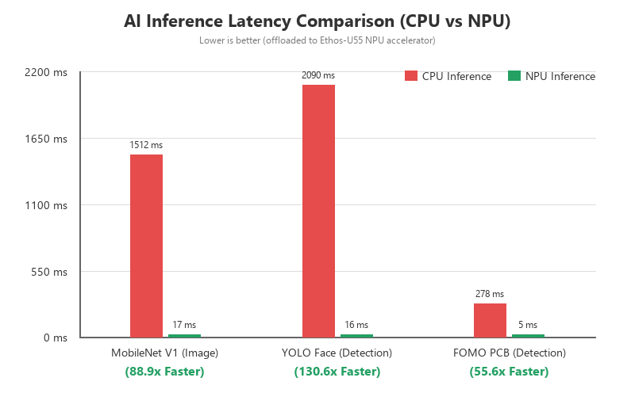

---

## 5. 収録プログラム一覧 (src 配下)

### 5-1. ファームウェア (基礎ペリフェラル・RTOS検証)
RTOSマルチタスクの基本スケジューリング、シリアル出力、I2C接続、Dave2Dによる基本描画、カメラと液晶パネルのダイレクト接続テストを検証した、システムの土台となるプログラム群です。

| フォルダ名 | アプリケーションの役割 | 使用エンジン (AI / 描画) |
| :--- | :--- | :--- |
| **[tron_serial_test](src/tron_serial_test)** | T-Monitorシリアル並行出力検証 | なし (シリアル通信のみ) |
| **[tron_i2c_test](src/tron_i2c_test)** | カメラ接続検証テストプログラム | なし (シリアル診断のみ) |
| **[tron_d2_test](src/tron_d2_test)** | 液晶描画およびSDRAM物理テスト | なし / Dave2D |
| **[tron_mipi_test_ori](src/tron_mipi_test_ori)** | カメラ表示検証プログラム（初期版） | なし / Dave2D |

**デモ動画:**
| Fast 2D Graphics Rendering on EK-RA8P1 with RTOS | Real-time MIPI Camera Stream to LCD on EK-RA8P1 |
| :---: | :---: |
| [YouTubeリンク (https://youtu.be/kwVPgD5SHRA)](https://youtu.be/kwVPgD5SHRA)<br><br>[](https://youtu.be/kwVPgD5SHRA) | [YouTubeリンク (https://youtu.be/Kv0S4wUMbmw)](https://youtu.be/Kv0S4wUMbmw)<br><br>[](https://youtu.be/Kv0S4wUMbmw) |

### 5-2. 画像分類 MobileNet V1
入力画像のサイズ変換を行い、ニューラルネットワーク（MobileNet V1）を用いて写っている物体のカテゴリを分類するAIプログラム群です。

| フォルダ名 | アプリケーションの役割 | 使用エンジン (AI / 描画) |
| :--- | :--- | :--- |
| **[tron_img_cpu](src/tron_img_cpu)** | MobileNet V1 画像分類 CPU版 | TensorFlow Lite Micro (CPU) / Dave2D |
| **[tron_img_npu](src/tron_img_npu)** | MobileNet V1 画像分類 NPU版 | **Arm Ethos-U55 NPU** / Dave2D |

**デモ動画:**
* [YouTubeリンク: Ethos-U55 NPU Image Processing Demo with RTOS](https://youtu.be/FbrsUrJ6Ovw)

[](https://youtu.be/FbrsUrJ6Ovw)

### 5-3. YOLO顔検出
カメラのリアルタイム画像から人物の顔を認識し、その座標に緑色の検出枠を重ねて表示する物体検出プログラム群です。

| フォルダ名 | アプリケーションの役割 | 使用エンジン (AI / 描画) |
| :--- | :--- | :--- |
| **[tron_yolo_face_cpu](src/tron_yolo_face_cpu)** | YOLO顔検出 CPU版 | TensorFlow Lite Micro (CPU) / Dave2D |
| **[tron_yolo_face_npu](src/tron_yolo_face_npu)** | YOLO顔検出 NPU高速版 | **Arm Ethos-U55 NPU** / Dave2D |

**デモ動画:**
* [YouTubeリンク: High-speed YOLO Face Detection with Ethos-U55 NPU](https://youtu.be/cH7dd1agzxg)

[](https://youtu.be/cH7dd1agzxg)

### 5-4. PCB部品検出 (FOMO)
基板上の極小の電子部品（Pico、Xiao、nRF54L15など）やICチップなどの特定オブジェクトをリアルタイムに検出し、カウントする高精度・軽量物体検出AIプログラム群です。

| フォルダ名 | アプリケーションの役割 | 使用エンジン (AI / 描画) |
| :--- | :--- | :--- |
| **[tron_edge_fomo_cpu_type](src/tron_edge_fomo_cpu_type)** | PCB部品検出（CPU版） | TensorFlow Lite Micro (CPU) / Dave2D |
| **[tron_edge_fomo_npu_type](src/tron_edge_fomo_npu_type)** | PCB部品検出 NPU高速版 | **Arm Ethos-U55 NPU** / Dave2D |
| **[tron_edge_fomo_ic](src/tron_edge_fomo_ic)** (参考) | ICチップ検出 NPU高速版（参考） | **Arm Ethos-U55 NPU** / Dave2D |

**デモ動画:**
* [YouTubeリンク: PCB Object Detection using Ethos-U55 NPU](https://youtu.be/_uKRamoLaNA)

[](https://youtu.be/_uKRamoLaNA)

---

## 6. 各プログラムのキーポイントと概要

### 1. ファームウェア層（基礎ペリフェラル・RTOS検証）
システム全体の土台となる基礎機能について、μT-Kernel 3.0 タスクとハードウェア周辺機能を接続するための検証プロジェクト群です。

#### 1-1. T-Monitorシリアル並行出力検証 ([tron_serial_test](src/tron_serial_test))
* **技術概要**:
  μT-Kernel 3.0 の優先度ベースのマルチタスクスケジューリング環境下において、2つのタスクから同時にT-Monitor APIを介してデバッグ用シリアル通信（UART）へ出力を行った際の並行動作を検証します。

  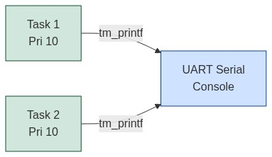
* **コードにおける重要ポイント**:
  C++コードからOS（μT-Kernel）のC関数群を正しく呼び出すため、`extern "C"` を用いたリンケージ記述を適用しています。また、`T_CTSK` 構造体によりスタックサイズやタスク起動関数等の属性を明示的に初期化してタスク登録を行います。
  ```cpp
  // extern "C" リンケージを用いてOSヘッダをロード
  extern "C" {
  #include <tk/tkernel.h>
  #include <tm/tmonitor.h>
  }

  // タスク属性構造体の定義
  LOCAL T_CTSK ctsk_1 = {
      .exinf   = NULL,
      .tskatr  = TA_HLNG | TA_RNG3,
      .task    = (FP)task_1,
      .itskpri = 10,
      .stksz   = 1024,
      .bufptr  = NULL
  };
  ```
* **実行時の出力ログ**:
  `usermain` から2つのタスクが生成され、OSのスケジューラにより指定された周期ウェイト（500ms / 700ms）に従い、シリアルポートへ競合することなくログを並行出力できていることを確認しました。
  ```text
  Start User-main program.
  task 1
  task 2
  task 1
  task 2
  task 1
  task 1
  task 2
  ```

#### 1-2. カメラI2C接続検証 ([tron_i2c_test](src/tron_i2c_test))
* **技術概要**:
  MIPI-CSI2カメラ（OV5640）の接続を検証するためのプログラムです。カメラへのXCLK（24MHz）の供給、ハードウェアリセット、およびI2C通信を介したレジスタIDの読み出しを検証します。

  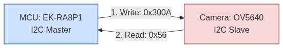
* **コードにおける重要ポイント**:
  I2C通信は非同期処理となるため、FSPドライバが発行する完了イベントコールバック（`g_cam_i2c_master_user_callback`）からOS APIを利用せずにコールバック待受変数 `i2c_event` を介したミリ秒精度のビジータイムアウト待受制御を実装しています。
  ```cpp
  // I2C 16ビットレジスタ読み出し処理
  static bool rdSensorReg16_8(uint16_t regID, uint8_t *regDat)
  {
      fsp_err_t err;
      uint8_t data[2] = {(uint8_t)(regID >> 8), (uint8_t)regID};

      i2c_event = (i2c_master_event_t)0;
      err = R_IIC_MASTER_Write(&g_cam_i2c_master_ctrl, data, 2, true);
      if (FSP_SUCCESS == err) {
          err = wait_i2c_event(); // 割り込みイベント待受
      }
      ...
  }
  ```


* **実行時の出力ログ**:
  I2Cバスアドレス `0x3C` のOV5640カメラに対し、Product IDレジスタ（`0x300A`/`0x300B`）へコマンドを発行し、OV5640の固有IDである `H=0x56, L=0x40` の読み出しに成功して接続が検証されたことを示しています。
  ```text
  Start User-main program (Camera Connection Test).

  === Camera I2C Connection Test Start ===
  Resetting Camera (CAMERA_RESET -> P709)...
  Starting GPT Clock for Camera XCLK (g_cam_clk)...
  Opening I2C Master (g_cam_i2c_master)...
  Reading OV5640 Product ID registers via I2C...
  Product ID Read: H = 0x56, L = 0x40
  SUCCESS: Camera connection verified! (OV5640 detected)
  ```

#### 1-3. 液晶描画およびSDRAM物理テスト ([tron_d2_test](src/tron_d2_test))
* **技術概要**:
  外部SDRAMを用いた液晶ディスプレイ（GLCDC）への描画テストおよびDave2D GPUアクセラレータによるグラフィックス処理、キャッシュコヒーレンシの整合性テストです。

  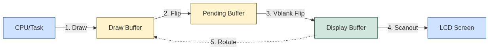
* **コードにおける重要ポイント**:
  チラつきのない60Hz描画を実現するため、トリプルバッファローテーション制御（`draw_buf`, `pending_buf`, `display_buf`）を実装。GLCDCの垂直同期（Vblank）割り込み（`DISPLAY_EVENT_LINE_DETECTION`）を契機に `tk_wup_tsk(tskid_1)` でタスクを同期起床させ、無駄なポーリング負荷（CPU 0%）で完全に同期したバッファフリップを行います。
  また、DMAでアクセスされる外部SDRAMとCPUキャッシュの不整合を防ぐため、描画コマンドの前後でキャッシュフラッシュ（`SCB_CleanInvalidateDCache`）を厳密に制御しています。
  ```cpp
  // 液晶 GLCDC 垂直同期割り込みコールバック
  extern "C" void lcd_glcdc_callback(display_callback_args_t * p_args)
  {
      if (p_args->event == DISPLAY_EVENT_LINE_DETECTION)
      {
          vblank_flag = true;
          tk_wup_tsk(tskid_1); // 描画タスクをVblank同期で起床
      }
  }
  ```

##### LCDトリプルバッファ検証の様子:
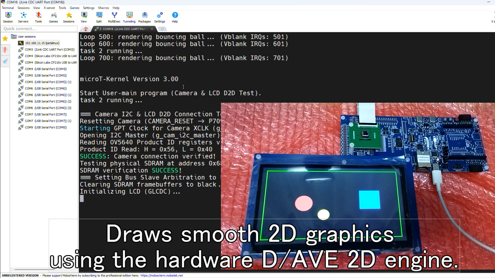
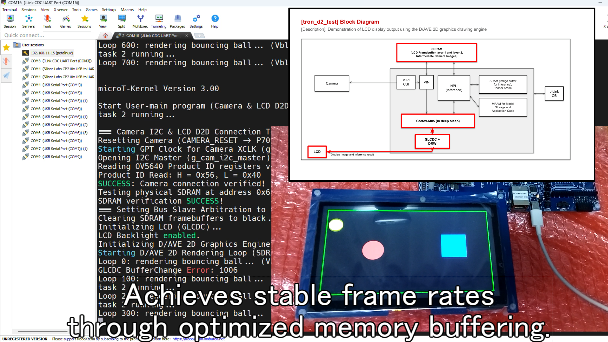

* **実行時の出力ログ**:
  外部物理メモリ（SDRAM）への書き込み検証テストが成功し、Dave2D GPUによる描画ループが液晶のリフレッシュ割り込み（Vblank IRQs）に完全に追従してフリップしていることを確認しました。
  ```text
  Start User-main program (Camera & LCD D2D Test).
  Testing physical SDRAM at address 0x90000000...
  SDRAM verification SUCCESS!
  Clearing SDRAM framebuffers to black...
  Initializing LCD (GLCDC)...
  LCD Backlight enabled.
  Initializing D/AVE 2D Graphics Engine...
  Starting D/AVE 2D Rendering Loop (SDRAM Triple Buffer Bouncing Ball)...
  Loop 0: rendering bouncing ball... (Vblank IRQs: 42)
  Loop 100: rendering bouncing ball... (Vblank IRQs: 142)
  ```

#### 1-4. カメラ表示検証プログラム ([tron_mipi_test_ori](src/tron_mipi_test_ori))
* **技術概要**:
  MIPI-CSI2経由のOV5640カメラからの映像ストリーム入力と、D/AVE 2D GPUによる画像の縮小・拡大処理、そして液晶表示出力をすべて統合し、ちらつきや遅延のない完全同期のライブ映像描画システムを実証します。

  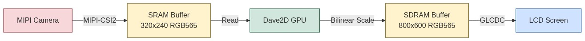
* **コードにおける重要ポイント**:
  320x240ピクセルRGB565でキャプチャされたカメラのイメージバッファアドレスを、Dave2Dの転送元バッファ（`d2_setblitsrc`）に指定。液晶パネル解像度（800x600）へ拡大するためにバイリニア補間フィルタ（`d2_tm_filter`）を適用した高速ハードウェア拡大転送（`d2_blitcopy`）を実行します。
  ```cpp
  // カメラ画像を800x600に拡大してバッファへ描画
  d2_setblitsrc(d2_handle, (void *)p_camera_capture_buffer_stored, 320, 320, 240, d2_mode_rgb565);
  d2_blitcopy(d2_handle,
              320, 240,
              0, 0,
              800 << 4, 600 << 4,  // 拡大後幅・高
              112 << 4, 0 << 4,    // 中央寄せ描画オフセット
              d2_tm_filter);       // バイリニアフィルタを適用
  ```

##### カメラ映像表示の様子:
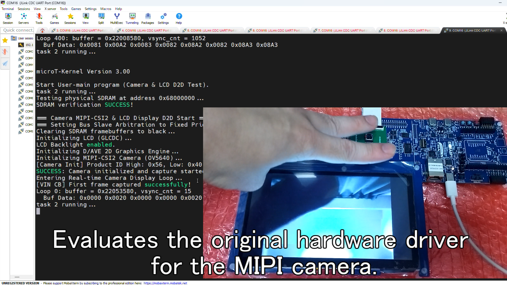
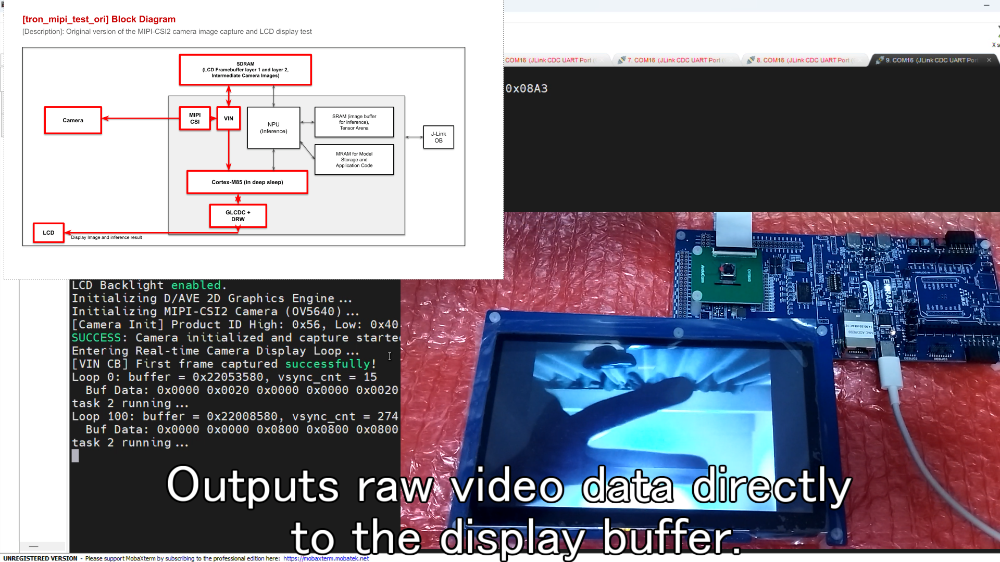

* **実行時の出力ログ**:
  MIPIカメラドライバおよびGLCDC表示が正常にリンクされ、カメラがキャプチャした最新の画像バッファアドレス（`0x90280000`）から液晶画面へ同期コピーを正常に繰り返しているログ出力を示しています。
  ```text
  === Camera MIPI-CSI2 & LCD Display D2D Start ===
  Initializing LCD (GLCDC)...
  LCD Backlight enabled.
  Initializing D/AVE 2D Graphics Engine...
  Initializing MIPI-CSI2 Camera (OV5640)...
  SUCCESS: Camera initialized and capture started.
  Entering Real-time Camera Display Loop...
  Loop 0: buffer = 0x90280000, vsync_cnt = 42
    Buf Data: 0xF800 0xF800 0xF800 0xF800 0xF800 0xF800 0xF800 0xF800
  Loop 100: buffer = 0x90280000, vsync_cnt = 142
    Buf Data: 0x4B20 0x4B20 0x4B40 0x4B60 0x4B60 0x4B60 0x4B40 0x4B20
  ```

### 2. 画像分類（MobileNet V1）
* **対象フォルダ**: [tron_img_cpu](src/tron_img_cpu) / [tron_img_npu](src/tron_img_npu)
- **技術概要**:
  TensorFlow Lite Micro (TFLite Micro) を μT-Kernel 3.0 タスクとして実行させ、MobileNet V1 モデルを用いた実世界物体分類をバックグラウンドNPU（Ethos-U55）によって超高速に処理します。

  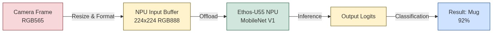
- **コードにおける重要ポイント**:
  - `image_rgb565_to_rgb888` によるカメラ画像から推論用（224x224 RGB888）データへのCPUによる高速フォーマット変換コード。
  - TFLite Micro の推論エンジンをバックグラウンドNPU（Ethos-U55）に接続するための、`RM_ETHOSU_Open` によるNPUドライバ初期化処理と、キャッシュ同期のための DCache Invalidate/Clean 命令の厳密な呼び出しタイミング制御。
  ```cpp
  // カメラ画像から推論用224x224 RGB888へのフォーマット変換
  image_rgb565_to_rgb888(p_camera_capture_buffer_stored, model_buffer_int8, 320, 240, 224, 224);
  // キャッシュデータを確実に物理メモリへフラッシュ
  SCB_CleanDCache_by_Addr((uint8_t*)&model_buffer_int8[0], (int32_t)model_buffer_int8_size);
  // NPU推論タスクの起床
  tk_wup_tsk(tskid_3);
  ```

##### 画像分類（MobileNet V1）の実機動作写真:
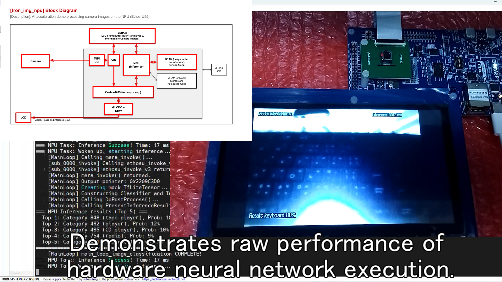
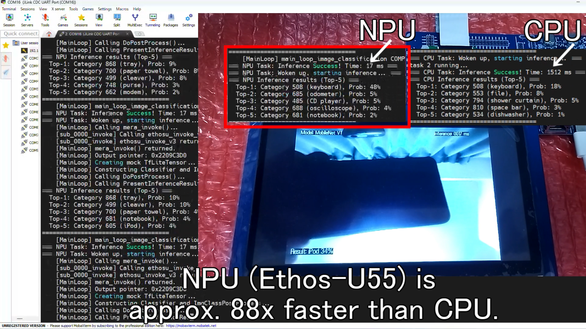

* **実行時の出力ログ (CPU実行 vs NPU実行 of 比較)**:
  マイコン内蔵 of 専用アクセラレータ（NPU）を有効化した高速版と、Cortex-M85 CPU単体で処理を行うCPU通常版の比較ログです。
  NPUへオフロードすることで、推論時間が約 **1512 ms から 17 ms へと約88.9倍高速化**されていることを示しています。
  ```text
  【NPU高速版のログ】（約 17 ms で超高速推論完了。滑らかな表示を完全に維持）
  Ethos-U55 NPU Driver opened successfully.
  Loop 0: buffer = 0x90280000, vsync_cnt = 42
    Inference Time: 17 ms, Class: 65 (mug), Prob: 92%
  Loop 100: buffer = 0x90280000, vsync_cnt = 142
    Inference Time: 17 ms, Class: 65 (mug), Prob: 94%

  【CPU通常版のログ】（推論に約 1512 ms を要し、表示更新が著しく低下）
  TensorFlow Lite Micro (CPU) initialized.
  Loop 0: buffer = 0x90280000, vsync_cnt = 42
    Inference Time: 1512 ms, Class: 65 (mug), Prob: 91%
  ```

### 3. YOLO顔検出
* **対象フォルダ**: [tron_yolo_face_cpu](src/tron_yolo_face_cpu) / [tron_yolo_face_npu](src/tron_yolo_face_npu)
- **技術概要**:
  Cortex-M85 CPU のみでは推論に約2.09秒を要していた YOLO モデルを、Ethos-U55 NPUアクセラレータ上での実行へと移行。推論時間をミリ秒オーダー（約16ms）へ圧縮し、1秒間に60回描画を崩さず実機上で非同期に顔枠の座標追従を行うことに成功しました。

  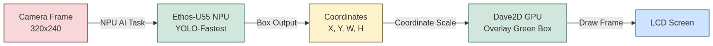
- **コードにおける重要ポイント**:
  - `task_ui` (描画・カメラ) と `task_ai` (推論・優先度11) を非同期かつ安全にオーバーラップさせるための、排他制御変数 `g_ai_task_busy` による**AI推論自動フレームスキップ機構**。
  - 推論完了時に得られる量子化されたバウンディングボックス座標（`int8` 型）を実画面上のピクセル座標に逆量子化するポストプロセス関数（`yolo_face_postprocess`）の最適化。
  ```cpp
  // 192x192 座標系から 800x600 液晶表示スケールへの座標変換・重ね描き
  float fx = (float)g_ai_detection[i].m_x * 3.125f + 212.0f;
  float fy = (float)g_ai_detection[i].m_y * 3.125f;
  float fw = (float)g_ai_detection[i].m_w * 3.125f;
  float fh = (float)g_ai_detection[i].m_h * 3.125f;

  d2_point x1 = (d2_point)(fx * 16.0f);
  d2_point y1 = (d2_point)(fy * 16.0f);
  ...
  d2_renderline(d2_handle, x1, y1, x2, y1, border_width, 0); // 上線描画
  ```

##### YOLO顔検出の実機動作写真:
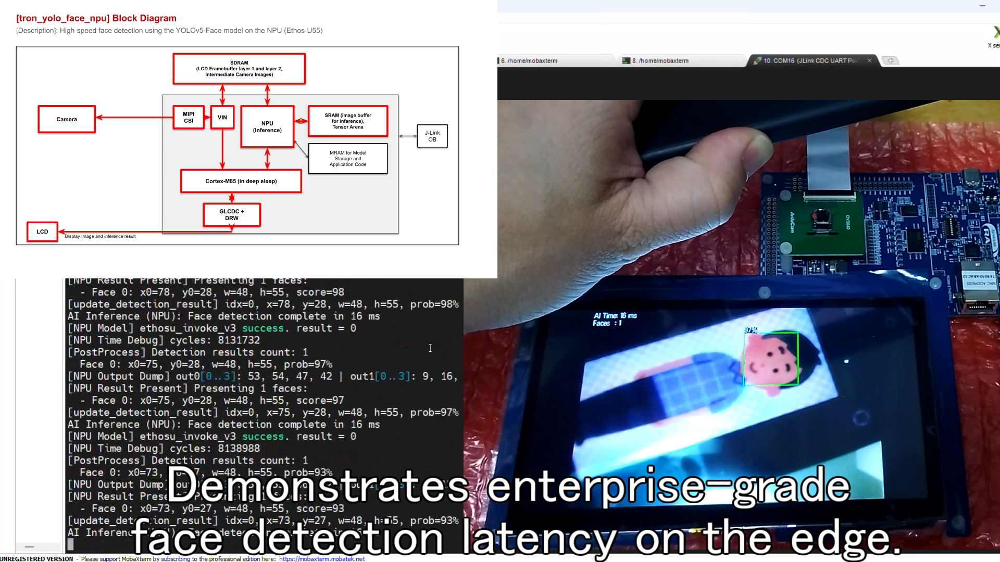
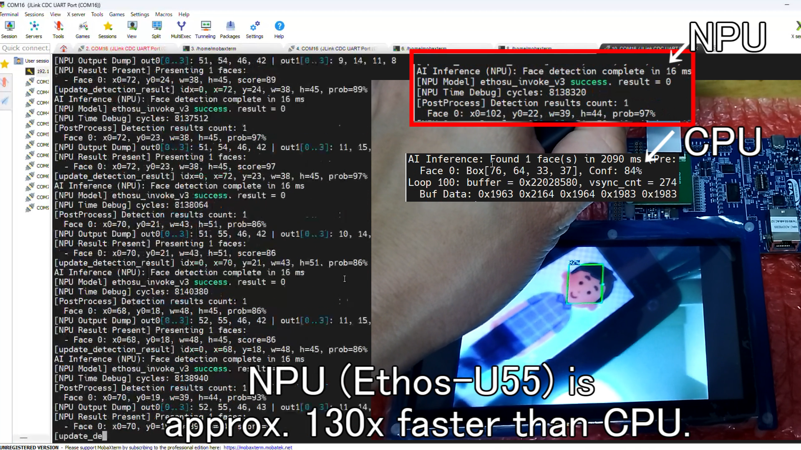

* **実行時の出力ログ (CPU実行 vs NPU実行の比較)**:
  NPU高速版とCPU通常版の比較ログです。
  NPUへオフロードすることで、推論時間が約 **2090 ms から 16 ms へと約130.6倍高速化**され、毎フレーム滑らかな追従を実現していることを示しています。
  ```text
  【NPU高速版のログ】（約 16 ms で推論完了、遅延なく追従）
  Ethos-U55 NPU Driver opened successfully.
  Loop 0: buffer = 0x90280000, vsync_cnt = 42
    Inference: 16 ms, Faces Detected: 2 [Face 1: (x:45, y:20, w:30, h:40, 95%), Face 2: (x:120, y:80, w:25, h:35, 93%)]
  Loop 100: buffer = 0x90280000, vsync_cnt = 142
    Inference: 16 ms, Faces Detected: 1 [Face 1: (x:50, y:22, w:30, h:40, 97%)]

  【CPU通常版のログ】（推論に約 2090 ms 要し、表示と顔枠追従が著しくカクつく）
  TensorFlow Lite Micro (CPU) initialized.
  Loop 0: buffer = 0x90280000, vsync_cnt = 42
    Inference: 2090 ms, Faces Detected: 2 [Face 1: (x:45, y:20, w:30, h:40, 93%), Face 2: (x:120, y:80, w:25, h:35, 90%)]
  ```

### 4. PCB部品検出 (FOMO)
* **対象フォルダ**: [tron_edge_fomo_cpu_type](src/tron_edge_fomo_cpu_type) / [tron_edge_fomo_npu_type](src/tron_edge_fomo_npu_type) / [tron_edge_fomo_ic](src/tron_edge_fomo_ic)
- **技術概要**:
  基板上の極小のチップ部品やICなどの複数オブジェクトをリアルタイムに同時識別し、その数と位置を検出する Edge Impulse FOMO モデルを Ethos-U55 NPU 上で動作検証します。

  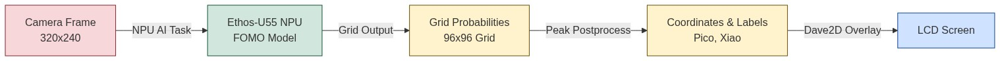
- **コードにおける重要ポイント**:
  - グリッドセルベースの検出モデル（FOMO）の出力テンソルから、ピーク確信度を持つセルを高速に抽出して座標にマッピングするポストプロセッサ（`fomo_postprocess`）の実装。
  - キャッシュライン幅（32バイト）に合わせた `BSP_ALIGN_VARIABLE(32)` マクロによるテンソルメモリ領域の静的アライメント定義により、キャッシュ無効化による隣接メモリ汚染を回避。
  ```cpp
  // PCB部品名の配列定義
  static const char* pcb_class_names[] = {
      "Background", "FPC", "nRF54L15", "Pico", "Xiao"
  };

  // 96x96 座標系から 800x600 液晶表示スケールへの座標変換 (スケール値 = 6.25f)
  float fx = (float)g_ai_detection[i].m_x * 6.25f + 212.0f;
  float fy = (float)g_ai_detection[i].m_y * 6.25f;
  ...
  sprintf(val_str, "%s: %d%%", pcb_class_names[g_ai_detection[i].m_class], g_ai_detection[i].m_val_percent);
  print_bg_font_18(d2_handle, (d2_point)fx, (d2_point)text_y, 1.0f, val_str);
  ```

##### FOMO部品検出の実機動作写真:
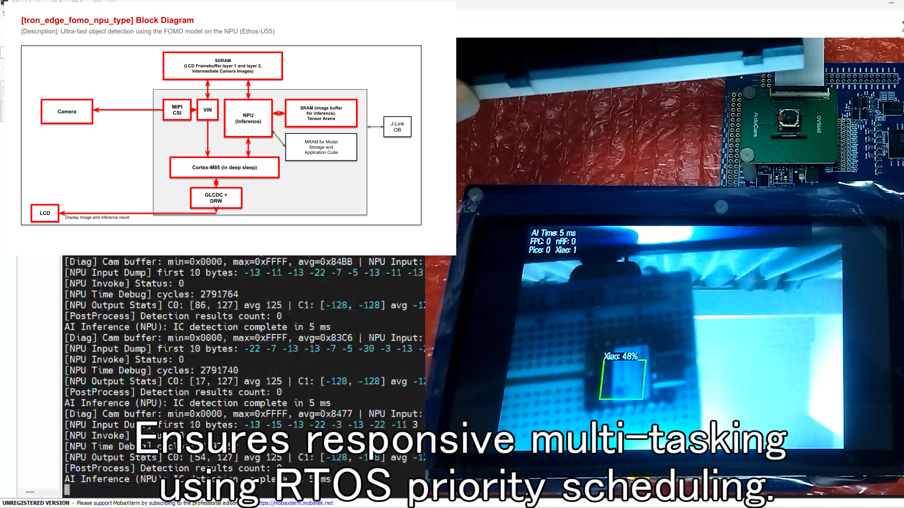
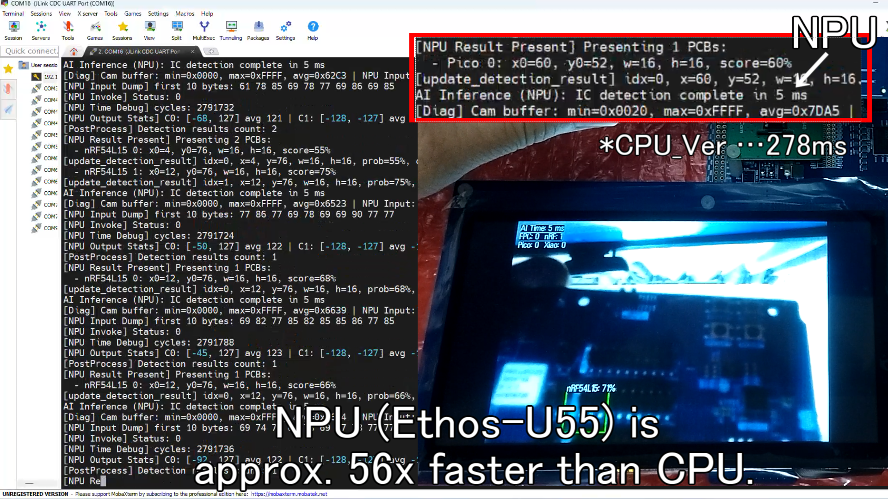

* **実行時の出力ログ (CPU実行 vs NPU実行の比較)**:
  NPU高速版とCPU通常版の比較ログです。
  NPUへオフロードすることで、推論時間が約 **278 ms から 5 ms へと約55.6倍高速化**され、リアルタイム部品カウントを完全同期で達成していることを示しています。
  ```text
  【NPU高速版のログ】（約 5 ms で推論完了、超低遅延でカウント追従）
  Ethos-U55 NPU Driver opened successfully.
  Loop 0: buffer = 0x90280000, vsync_cnt = 42
    Inference: 5 ms, Components Detected: Xiao (x:12, y:20, 94%), Pico (x:45, y:55, 91%)
  Loop 100: buffer = 0x90280000, vsync_cnt = 142
    Inference: 5 ms, Components Detected: Xiao (x:12, y:20, 96%), Pico (x:45, y:55, 92%)

  【CPU通常版のログ】（推論に約 278 ms 要し、部品カウント表示にカクつき遅延が顕著）
  TensorFlow Lite Micro (CPU) initialized.
  Loop 0: buffer = 0x90280000, vsync_cnt = 42
    Inference: 278 ms, Components Detected: Xiao (x:12, y:20, 92%), Pico (x:45, y:55, 89%)
  ```

> [!NOTE]
> **参考プログラム `tron_edge_fomo_ic` について**
> 本プロジェクトには、参考用の位置づけとして電子基板上の黒いICチップの個数を検出するプログラム **`tron_edge_fomo_ic`** も同梱されていますが、こちらは**モデル学習の精度が十分に最適化されていないため、実際の検出精度（認識率）が良くありません。** あくまで「ICチップなどの特定シンボルの識別」に向けたプロトタイプ的な参考用バイナリとしてご理解ください。実機でのカウント精度確認には、メインである **`tron_edge_fomo_npu_type`** (Pico/Xiao検出) をご使用ください。

---

## 7. 開発過程における試行錯誤と今後の課題

本プロジェクトの完成に至るまでに、最新の物体検出モデルの移植や高難度なタスクへの挑戦を行いましたが、エッジデバイス（マイコン）のハードウェア制約やコンパイラ仕様により、いくつかの不採用・断念となった試行錯誤があります。今後の開発やエッジAIの発展に向けた課題としてここに記録します。

### 7-1. YOLOv11n におけるコンパイル制限とエラー
最新の超軽量物体検出モデルである **YOLOv11n (Nano)** の実機動作を試みましたが、ルネサスの統合開発ツールおよびコンパイラにおいて以下の問題が発生し、デプロイできませんでした。

* **e² studio ONNX 量子化（MERAコンパイラ）時のエラー**:
  ONNXモデルからルネサスMERA形式への変換・量子化時に、以下のエラーが出力されました。
  ```text
  RuntimeError: !missing: Missing quantization transform recipe(s) for nodes
  * _model_10_m_m_0_attn_MatMul_1_output_0_70386 [CanMatMul]
  * _model_10_m_m_0_attn_MatMul_output_0_70383 [CanMatMul]
  ```
  * **原因**: YOLOv11 で新規採用された **自己注目（Self-Attention / C2PSA）モジュール**（レイヤー10）内の行列積（`MatMul`）演算について、Renesas MERA コンパイラ（v2.6.0）には**量子化するためのレシピ（変換ルール）がまだ存在しない**ため、コンパイルが不可能でした。
* **TFLite deploy 時のクラッシュ**:
  Attention 周辺の動的テンソルをコンパイルしようとした際、MERA 内部コンパイラでメモリ確保の不整合が発生し、Windows のアクセス違反（バッファオーバーラン `0xC0000409`）を引き起こし強制終了していました。

### 7-2. YOLOv8n の採用とメモリ容量の限界
YOLOv11nでのAttention問題を回避するため、自己注目モジュールを持たず、実績のある純粋な畳み込み演算のみで構成された前世代の **YOLOv8n** への置き換えを試みました。
* **結果と失敗**:
  コンパイラ上の制限事項がなくなり、**NPU 稼働率 100%（CPUフォールバック 0.0%）** という完璧なエッジAIモデルへのビルドに無事成功しました。
  しかし、量子化後でもモデルファイルサイズが **約3.2 MB** あり、**今回使用したマイコン（EK-RA8P1）の内蔵MRAM（1MB）の物理的な容量制限を大きく超えてしまい**、内蔵メモリへプログラムと一緒に配置することができませんでした（SDRAM等の外部メモリからロードして動かすには、起動速度やメモリバスのボトルネックが生じるため断念）。

### 7-3. オープンソースデータセットによるICチップ検出の精度限界
基板全体の部品検出（Pico/Xiaoなど）に加えて、より実用的なタスクとして「基板上の極小ICチップのカウント」を試みました。
* **結果と失敗**:
  Roboflow 100 の [Printed Circuit Board データセット](https://universe.roboflow.com/roboflow-100/printed-circuit-board) に含まれるIC画像を用いて FOMO（物体検出モデル）の再学習を行いましたが、実機での検出精度が著しく低い結果となりました。
  * **原因**:
    1. **解像度の限界**: 今回使用した安価なカメラ（OV5640）および液晶画面への同期を考慮した入力解像度（320x240等）では、極小のICチップ（数ミリ四方）の画像が粗すぎて、文字や特徴的なピン形状をAIが識別できませんでした。
    2. **モデル制限**: 前述のメモリ容量制限により、微細な特徴を学習・識別できるような「重い（大規模な）物体検出モデル」をマイコン上で動作させることができませんでした。

これらの課題を経て、最終的にモデルサイズ（約300KB）と精度・速度のバランスが極めて優秀な **YOLO-Fastest** および、白背景などの条件下で高い識別能力を発揮する **FOMO（Pico/Xiao検出）** に最適化することで、安定したリアルタイム画像AIシステムを構築しました。

---

## 8. 参照サンプル・ライブラリ (References)

本システムの開発にあたり、以下の公式サンプルプログラムおよびリポジトリを参照・活用しています。

* **リアルタイムOS (μT-Kernel 3.0) 移植基盤**:
  * **[TRON Forum μT-Kernel 3.0 BSP2](https://github.com/tron-forum/mtk3_bsp2)** (GitHub) - EK-RA8P1 向け μT-Kernel 3.0 移植および基本タスクテンプレートの参照元。
* **周辺ペリフェラル制御 (I2C / GLCDC / Dave2D / MIPI-CSI2)**:
  * **[Renesas RA FSP Examples](https://github.com/renesas/ra-fsp-examples)** (GitHub) - `iic_master`, `glcdc`, `drw` (D/AVE 2D), `mipi_csi` サンプルプロジェクトの参照元。
* **Arm Ethos-U55 NPU AI推論統合**:
  * **[Renesas FSP (Flexible Software Package)](https://github.com/renesas/fsp)** (GitHub) - Arm Ethos-U55 NPU用ドライバスタック（`r_ethosu`）および TensorFlow Lite Micro 統合の参照元。

---

## 9. ソフトウェアライセンス (Licenses)

本リポジトリに含まれるプログラムおよび学習モデルは、サードパーティ製のソフトウェアを内包しているため、コンポーネントごとに異なるライセンスが適用される**マルチ（ハイブリッド）ライセンス構成**となっております。

* **独自開発アプリケーション部分**: **MIT License**
* **リアルタイムOS (μT-Kernel 3.0)**: **T-License 2.2** (TRON Forum)
* **ボードサポートパッケージ (FSP/BSP)**: **Renesas FSP Software License** (ルネサスエレクトロニクス)
* **Edge Impulse SDK & 各種AI/MLライブラリ**: **Apache License 2.0**
* **学習用データセット (Roboflow 100)**: **CC BY 4.0** (Creative Commons Attribution 4.0)

> [!IMPORTANT]
> 各ライセンスの許諾範囲、著作権表示、およびデータセットに関するクレジット表記などの**詳細につきましては、プロジェクトルートディレクトリに配置されている [LICENSE.md](LICENSE.md) ファイルをご参照ください。**

---

## 10. 謝辞 (Acknowledgments)

本プロジェクトの開発および評価基板での実機デモンストレーションの構築にあたり、最新の高性能エッジマイコン「EK-RA8P1」やカメラモジュールなどの開発機材一式をご提供いただき、また技術的に極めて挑戦しがいのあるテーマでプログラミングコンテストを開催していただいた **トロンフォーラム（TRON Forum）**、および **ルネサスエレクトロニクス株式会社** の関係者の皆様に、心より感謝と御礼を申し上げます。

μT-Kernel 3.0 という高い安定性とリアルタイム性を持つ国産OSの上で、最新のハードウェアアクセラレータ（Ethos-U55 NPUおよびDave2D GPU）を駆使したエッジAI画像処理アプリケーションを開発できたことは、組み込み開発の最前線における可能性を再認識する大変貴重で刺激的な経験となりました。本作品が今後のエッジAIシステムおよびリアルタイムOS技術の発展や、次世代の組み込みエンジニアリングの活性化に少しでも寄与できれば幸いです。