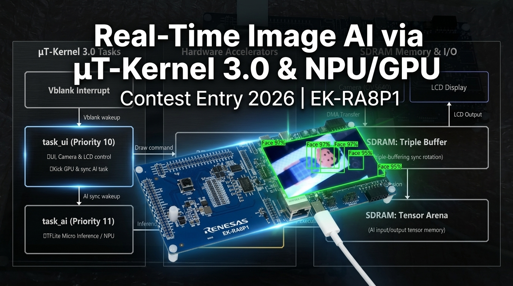

# Real-Time Image AI Recognition via μT-Kernel 3.0 and NPU/GPU (EK-RA8P1)

This repository houses the development project for the TRON Programming Contest 2026, utilizing the Renesas **EK-RA8P1** evaluation board (Cortex-M85 / Arm Ethos-U55 NPU / Dave2D GPU) and the **μT-Kernel 3.0** real-time OS.
It achieves an ultra-fast, flicker-free real-time display and deterministic control by running camera capture, GPU rendering, and AI inference completely in parallel.

📄 **[日本語版 (README.md)](README.md)**

---

## 1. System Overview

This system captures real-time video streams from a MIPI-CSI2 camera (OV5640), performs inference using deep learning models (YOLO-Fastest, FOMO) for object and face detection, and overlays the detection bounding boxes onto a TFT LCD panel (1024x600 resolution) using high-speed vector graphics.

### "TRON × AI" Synergy
A major bottleneck in embedded AI is that neural network inference (heavy matrix calculations) can occupy the CPU for extended periods, causing display lag (jitter) or missed sensor events.
This project combines μT-Kernel 3.0's priority-based multi-task scheduling with dedicated hardware accelerators (NPU/GPU) to solve this bottleneck. We successfully maintain **fluid display rendering (60 Hz)** while running **background AI inferences (taking only a few milliseconds)**, demonstrating a highly practical, low-latency AI edge application.

---

## 2. Hardware Configuration

* **MCU / Board**: Renesas RA8 Series (EK-RA8P1 / Cortex-M85 480MHz)
* **AI Accelerator**: Arm Ethos-U55 NPU (Neural Processing Unit)
* **2D GPU**: D/AVE 2D Graphics Engine (handles scaling, blitting, and line overlays)
* **Camera**: MIPI-CSI2 Connected OV5640 (320x240 RGB565 Input)
* **LCD Display**: GLCDC-driven 1024x600 TFT panel (RGB565)
* **Memory**: External SDRAM (allocated for Triple Framebuffers and tensor arenas)

| Hardware Block Diagram | EK-RA8P1 Evaluation Board |
| :---: | :---: |
|  |  |

---

## 3. System Architecture

### μT-Kernel 3.0 Multi-Task Scheduling (Parallel Pipeline)
The system divides its workload into two separate tasks running concurrently on the RTOS:

* **UI & Camera Task (`task_ui` / Priority 10)**: 
  Manages camera DMA capture, handles GLCDC frame flips, issues drawing commands to the Dave2D GPU, and renders bounding box overlays.
* **AI Inference Task (`task_ai` / Priority 11)**: 
  Manages preprocessing and runs model inference via the Arm Ethos-U55 NPU driver.

### Dave2D GPU & Ethos-U55 NPU Cooperative Sequence
To drive heavy AI inferences in the background without affecting the 60 Hz display refresh rate, the system coordinates the on-chip 2D GPU (Dave2D) and NPU using the following parallel pipeline:

1. **Vblank Sync**: The UI task wakes up upon receiving a Vblank interrupt callback (`tk_wup_tsk`).
2. **Issue GPU Command**: Fetches the camera frame and sends commands to the GPU to scale the input and overlay bounding boxes from the *previous* frame.
3. **AI Task Kick**: Wakes up the AI task (`tk_wup_tsk(tskid_ai)`) immediately, *before* blocking on the GPU.
4. **Cooperative Acceleration**: The AI task initiates NPU inference, establishing a state where **"the GPU is rendering the previous frame"** while **"the NPU is running inference on the next frame"** concurrently.
5. **Vsync Flip**: The UI task blocks until the GPU finishes (`d2_flushframe`), flips the GLCDC active buffer, and sleeps until the next Vblank edge.

This pipeline eliminates screen tearing and keeps the CPU free for other processes, yielding a smooth 60 Hz display alongside ultra-low latency AI detection.

### AI Inference Acceleration: CPU to NPU (Real-Time & Deterministic Control)
To objectively evaluate the processing capability of the NPU, **we developed and compiled alternative "CPU versions" of each application (running TFLite Micro strictly on the Cortex-M85 CPU without NPU acceleration) and conducted detailed benchmark measurements on the actual target board.**

The benchmarks demonstrate that offloading heavy AI inference to the dedicated on-chip NPU accelerator achieves dramatic performance improvements compared to CPU-only execution. By outsourcing inference to the NPU, CPU utilization drops near zero, enabling the RTOS task scheduler to maintain strict, deterministic real-time control without display jitter.

* **NPU Acceleration Effects (Actual Benchmarks: CPU-only vs NPU)**:
  * **MobileNet V1 Image Classification**: Reduced latency from 1,512 ms on the CPU to **17 ms (an ~88.9x speedup)**.
  * **YOLO Face Detection**: Reduced latency from 2,090 ms on the CPU to **16 ms (a ~130.6x speedup)**.
  * **FOMO Component Detection**: Reduced latency from 278 ms on the CPU to **5 ms (a ~55.6x speedup)**.

---

## 4. Sub-Project Directory List (under src)

### 4-1. Firmware & Baseline Integration
These baseline projects validate core peripherals (UART, I2C, Dave2D GPU, MIPI-CSI2 camera, and GLCDC screen flips) under μT-Kernel 3.0 task execution.

| Folder | Application Role | Acceleration Engine (AI / Graphics) |
| :--- | :--- | :--- |
| **[tron_serial_test](src/tron_serial_test)** | Validates parallel serial print on T-Monitor | None (Serial communication only) |
| **[tron_i2c_test](src/tron_i2c_test)** | Camera hardware registration diagnostics | None (I2C diagnostic utility) |
| **[tron_d2_test](src/tron_d2_test)** | GPU rendering test on LCD | None / Dave2D GPU |
| **[tron_mipi_test_ori](src/tron_mipi_test_ori)** | Live camera stream to GLCDC | None / Dave2D GPU |

**Demo Video:**
| Fast 2D Graphics Rendering on EK-RA8P1 with RTOS | Real-time MIPI Camera Stream to LCD on EK-RA8P1 |
| :---: | :---: |
|  [YouTube Link (https://youtu.be/kwVPgD5SHRA)](https://youtu.be/kwVPgD5SHRA) |  [YouTube Link (https://youtu.be/Kv0S4wUMbmw)](https://youtu.be/Kv0S4wUMbmw) |

### 4-2. Image Classification MobileNet V1
Loads a downscaled camera frame into the neural network (MobileNet V1) to output the recognized object class.

| Folder | Application Role | Acceleration Engine (AI / Graphics) |
| :--- | :--- | :--- |
| **[tron_img_cpu](src/tron_img_cpu)** | MobileNet V1 Image Classification on CPU | TensorFlow Lite Micro (CPU) / Dave2D |
| **[tron_img_npu](src/tron_img_npu)** | MobileNet V1 Image Classification on NPU | **Arm Ethos-U55 NPU** / Dave2D |

**Demo Video:**

* [YouTube Link: Ethos-U55 NPU Image Processing Demo with RTOS](https://youtu.be/FbrsUrJ6Ovw)

### 4-3. YOLO Face Detection
Detects human faces in real-time camera streams and overlays green bounding box frames.

| Folder | Application Role | Acceleration Engine (AI / Graphics) |
| :--- | :--- | :--- |
| **[tron_yolo_face_cpu](src/tron_yolo_face_cpu)** | YOLO Face Detection on CPU | TensorFlow Lite Micro (CPU) / Dave2D |
| **[tron_yolo_face_npu](src/tron_yolo_face_npu)** | YOLO Face Detection on NPU | **Arm Ethos-U55 NPU** / Dave2D |

**Demo Video:**

* [YouTube Link: High-speed YOLO Face Detection with Ethos-U55 NPU](https://youtu.be/cH7dd1agzxg)

### 4-4. PCB Component Detection (FOMO)
Identifies and counts tiny electronic components (Pico, Xiao, nRF54L15) and IC chips on PCBs using the highly efficient Edge Impulse FOMO model.

| Folder | Application Role | Acceleration Engine (AI / Graphics) |
| :--- | :--- | :--- |
| **[tron_edge_fomo_cpu_type](src/tron_edge_fomo_cpu_type)** | PCB component detection (FOMO) on CPU | TensorFlow Lite Micro (CPU) / Dave2D |
| **[tron_edge_fomo_npu_type](src/tron_edge_fomo_npu_type)** | PCB component detection on NPU | **Arm Ethos-U55 NPU** / Dave2D |
| **[tron_edge_fomo_ic](src/tron_edge_fomo_ic)** (Reference) | IC chip detection on NPU (Reference) | **Arm Ethos-U55 NPU** / Dave2D |

**Demo Video:**

* [YouTube Link: PCB Object Detection using Ethos-U55 NPU](https://youtu.be/_uKRamoLaNA)

---

## 5. Sub-Project Key Implementations & Technical Points

### 1. Firmware Layer (Peripheral & RTOS Integration)
* **Target Folders**: [tron_d2_test](src/tron_d2_test) / [tron_mipi_test_ori](src/tron_mipi_test_ori)
- **Overview**:
  Validated Renesas RA8 specialized peripherals (Dave2D GPU, GLCDC LCD controller, and MIPI-CSI2 camera interface) under μT-Kernel 3.0 task management to construct a robust hardware integration baseline.
- **Key Code Implementation Points**:
  - Implemented a secure **Triple-Buffering Rotation** (`draw_buf`, `pending_buf`, and `display_buf`) inside `usermain.cpp`. Using GLCDC callbacks and `tk_slp_tsk`/`tk_wup_tsk` wakes up the drawing task synchronously at 16.6 ms intervals, securing screen synchronization without tearing.
    
    | LCD Triple-Buffer Verification (1) | LCD Triple-Buffer Verification (2) |
    | :---: | :---: |
    |  |  |
    
  - Offloaded camera image scaling (320x240 RGB565 to 800x600) to the D/AVE 2D GPU via bilinear interpolation commands, keeping CPU load near zero.
    
    | Scaled Camera Stream (1) | Scaled Camera Stream (2) |
    | :---: | :---: |
    |  |  |

### 2. Image Classification (MobileNet V1)
* **Target Folders**: [tron_img_cpu](src/tron_img_cpu) / [tron_img_npu](src/tron_img_npu)
- **Overview**:
  Hosted the TensorFlow Lite Micro engine inside a μT-Kernel 3.0 task to run real-time MobileNet V1-based object classification on live camera streams.
- **Key Code Implementation Points**:
  - Optimized camera RGB565 frame conversions to the 224x224 RGB888 format expected by the model.
  - Integrated NPU driver initialization (`RM_ETHOSU_Open`) and coupled it with strict D-Cache maintenance operations (`SCB_CleanDCache_by_Addr` and `SCB_InvalidateDCache_by_Addr`) to prevent CPU-NPU data mismatch under Cortex-M85 caching.

    | Image Classification (1) | Image Classification (2) |
    | :---: | :---: |
    |  |  |

### 3. YOLO Face Detection
* **Target Folders**: [tron_yolo_face_cpu](src/tron_yolo_face_cpu) / [tron_yolo_face_npu](src/tron_yolo_face_npu)
- **Overview**:
  Offloaded the YOLO-based object detection model (which takes ~2,090 ms on the CPU) to the Ethos-U55 NPU, squeezing latency down to **16 ms** and securing fluid face bounding-box overlays on the 60 Hz display.
- **Key Code Implementation Points**:
  - Implemented an **asynchronous frame-skipping pipeline** governed by a state flag (`g_ai_task_busy`) to separate the 60 Hz display loop (`task_ui`) from the variable-rate AI task (`task_ai` / Priority 11).
  - Optimized the inverse quantization and coordinate mapping post-process (`yolo_face_postprocess`) to map the int8 quantization outputs back to physical display pixels quickly.

    | YOLO Face Detection (1) | YOLO Face Detection (2) |
    | :---: | :---: |
    |  |  |

### 4. PCB Component Detection (FOMO)
* **Target Folders**: [tron_edge_fomo_cpu_type](src/tron_edge_fomo_cpu_type) / [tron_edge_fomo_npu_type](src/tron_edge_fomo_npu_type) / [tron_edge_fomo_ic](src/tron_edge_fomo_ic)
- **Overview**:
  Validated the Edge Impulse FOMO model on the Ethos-U55 NPU to identify and count tiny components (Pico, Xiao, nRF54L15) and IC chips on PCBs in real-time.
- **Key Code Implementation Points**:
  - Developed a fast post-processor (`fomo_postprocess`) that parses the grid-cell output tensors to extract and label coordinates of multiple components.
  - Strictly aligned the tensor arena in SRAM/SDRAM to the Cortex-M85 32-byte cache line limit via `BSP_ALIGN_VARIABLE(32)`, preventing neighboring memory blocks from getting corrupted during cache invalidations.

    | FOMO Component Detection (1) | FOMO Component Detection (2) |
    | :---: | :---: |
    |  |  |

---

## 6. Development Environment & Execution
* **Integrated Development Environment (IDE)**: e2 studio (Renesas) / FSP v6.5.0
* **Real-Time OS (RTOS)**: μT-Kernel 3.0
* **Target Board**: EK-RA8P1 Evaluation Board
* **How to Build**: Run `build.bat` inside each program directory, or import the project into e2 studio. Connect to a serial terminal (115200 bps) to inspect initialization and real-time inference result logs.
