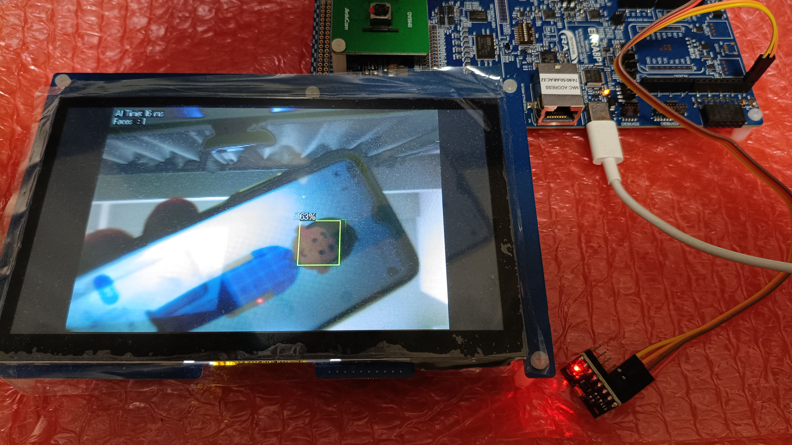
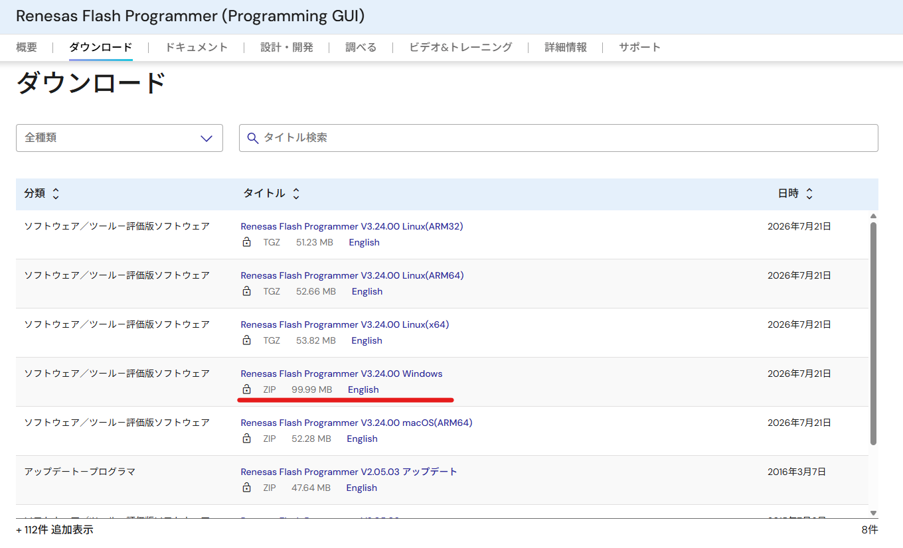
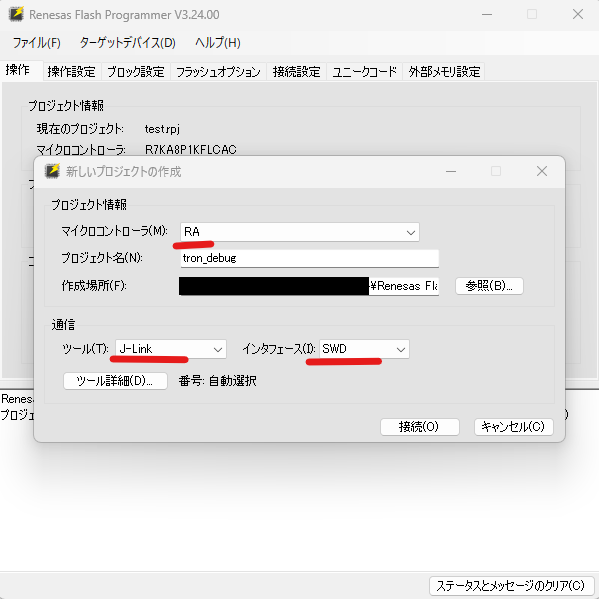
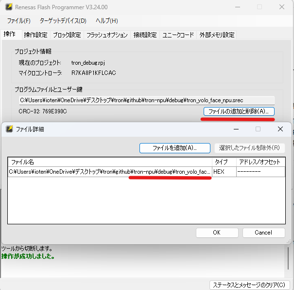
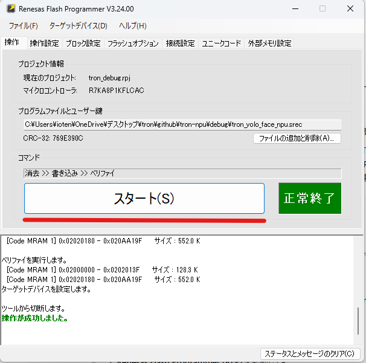
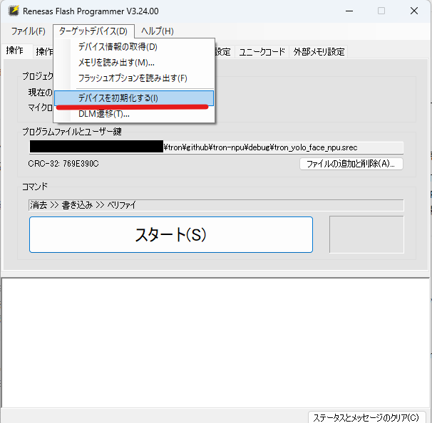
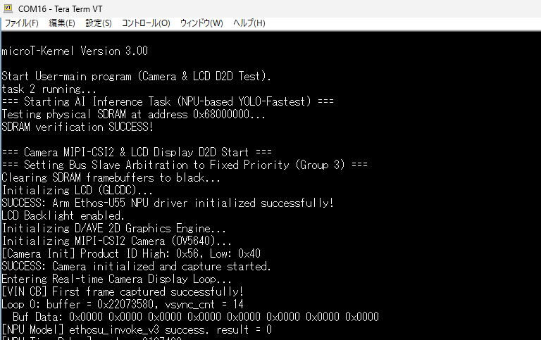
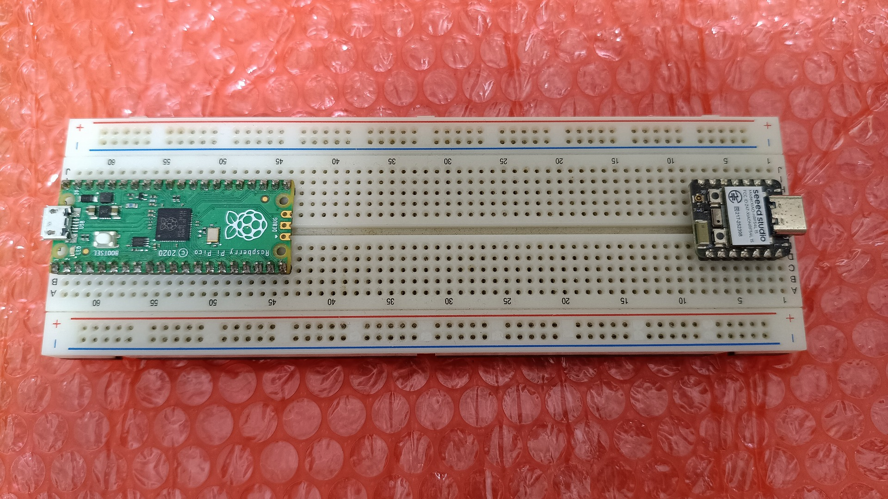

# EK-RA8P1 書き込み用バイナリフォルダ (debug)

本フォルダは、μT-Kernel 3.0 および各種エッジAIプログラムを Renesas EK-RA8P1 評価ボードへ書き込むためのバイナリファイル（`.srec` および `.elf`）を集約・整理したフォルダです。

> [!NOTE]
> **動作対象ボードに関する重要なお知らせ**
> * 本フォルダ内のプログラムによる動作確認作業は、**「EK-RA8P1 評価ボード単体」のみで十分に可能**です。
> * なお、別部門の応募において、下図のように**「I2Cセンサー（加速度センサーや配線など）が接続された状態のボード」**を事務局に提出しておりますが、**そのセンサー付きボードでも、気にせずそのままテスト（書き込み・実行）を行っていただけます。**（接続されているセンサーや配線が、各プログラムの動作や書き込みに悪影響や干渉を与えることはございません）
>
> 

---

## 1. フォルダ構成

本フォルダは、作業効率化のために以下のように役割別に整理されています。

* **`debug/` 直下 (メイン)**:
  実機での動作デモや審査で使用する、**Arm Ethos-U55 NPUによる高速AI処理**が有効になった代表的な3つのプログラムです。
  * `tron_yolo_face_npu.srec` (YOLO顔検出 NPU高速版)
  * `tron_img_npu.srec` (MobileNet画像分類 NPU高速版)
  * `tron_edge_fomo_npu_type.srec` (FOMO基板部品検出 NPU高速版)
* **`base_firmware/`**:
  液晶描画やカメラ接続テストなど、基本ペリフェラルとRTOSの動作検証用プログラムのSRECです。
* **`cpu_ai_versions/`**:
  NPU高速化の効果を比較するために開発された、**CPU通常処理版**のAIプログラムのSRECです（推論速度の違いを測定するために使用します）。
* **`elf_files/ (参考)`**:
  e2 studioのデバッガ等からロードしてステップ実行などを行う場合に使用する、シンボル情報付きのデバッグ用ELFファイル群です。

---

## 2. 書き込みツールの入手先

書き込みには、ルネサスエレクトロニクス公式の無料書き込みソフトウェア **Renesas Flash Programmer (Programming GUI)** を使用します。

* **ダウンロードページ**:
  [Renesas Flash Programmer (Programming GUI) 公式サイト](https://www.renesas.com/ja/software-tool/renesas-flash-programmer-programming-gui#downloads)
  * 上記リンク先のダウンロードセクションより、最新のインストーラ（Windows版もしくはPCに合った環境）をダウンロードしてPCにインストールしてください。

---

## 3. 書き込み手順 (プロジェクト作成から書き込みまで)

PCとボードを接続し、プロジェクトを作成してプログラムを書き込むまでの全手順です。

### ① ハードウェアの接続
1. パソコンと EK-RA8P1 ボード上のオンボードデバッガ用USBポート **`DEBUG1`**（micro-USB または USB-C）をUSBケーブルで接続します。

> [!WARNING]
> **液晶画面が真っ白になる現象（フリーズバグ）への対処**
> USBケーブルを挿し込んだ際、稀に下図のように液晶画面が真っ白になってフリーズする現象が発生することがあります。この現象が発生した場合は、**USBケーブルを一度抜いて、数秒〜数十秒ほど時間を置いてから、挿し直してください。**
>
> 

2. ボードの電源が入っている（LEDが点灯している）ことを確認します。

### ② プロジェクトの作成と設定

1. インストールした **Renesas Flash Programmer (RFP)** を起動します。
2. メニューの **[ファイル] ➡ [新しいプロジェクトの作成...]** を選択し、表示されるダイアログを以下のように設定します。

| 設定項目 | 設定値 |
| :--- | :--- |
| **マイクロコントローラ** | **`RA`** を選択 |
| **プロジェクト名** | 任意の名前（例: `RA8P1_Demo`） |
| **作成場所** | 任意のフォルダ（デフォルトのままでOK） |
| **通信ツール** | **`J-Link`** を選択 |
| **インターフェース** | **`SWD`** を選択 |

3. 入力後、右下の **[作成(C)]** をクリックします。これでターゲットボードとの接続が確立されます。

### ③ プログラムファイル（SREC）の選択

1. プロジェクト画面が開いたら、中央の「プログラムファイルとユーザー鍵」枠にある **[ファイルの追加と削除(A)...]** または入力欄の右側のボタンをクリックします。
2. 本 `debug/` フォルダ配下から、書き込みたいプログラムの **`.srec` ファイル**（例: `tron_yolo_face_npu.srec`）を選択してロードします。
   * ※ファイルがロードされると、アドレス範囲やCRC-32値が画面に自動表示されます。

### ④ [重要] 書き込み前のデバイス初期化（アドレスエラー防止）

YOLOやMobileNetなどの容量の大きいプログラムを書き込む際、マイコン側に残っている古いメモリ境界の仕切り設定と競合し、書き込み開始時に以下のエラーが発生して失敗することがあります。
> `エラー(E1000008): デバイスでアドレスエラーが発生しました。(Command: 13, Response: D2)`

このエラー（安全装置による書き込みブロック）を未然に防ぐため、**ファイルをロードした後、書き込みをスタートする前に、必ず以下の「デバイスの初期化」を実行してください。**

1. RFPの上部メニューバーにある **`ターゲットデバイス(D)`** をクリックします。
2. ドロップダウンメニューから **`デバイスの初期化(I)...`** を選択して実行します。

3. 画面右側に緑色で「デバイスの初期化が成功しました」と表示されるのを待ちます。
   * （これによりマイコンの古いメモリ境界設定がクリアされ、新しいプログラムサイズに合わせた書き込みが可能になります）

### ⑤ 書き込みの実行

1. デバイスの初期化が完了したら、画面中央にある大きな **[スタート(S)]** ボタンをクリックします。
2. 自動でデバイス消去 ➡ 書き込み ➡ 照合（ベリファイ）が実行されます。
3. 書き込みが成功すると、画面右側に緑色の背景で **「操作が成功しました」** と表示されます。

4. 書き込み完了後、ボード上の `RESET` ボタン（赤いスライドスイッチ付近にある黒い小さなタクトスイッチ）を押すか、USBケーブルを抜き差しすると、新しいプログラムが再起動して動作を開始します。

### ⑥ USBシリアルログの確認手順

書き込み完了後、接続しているPC上のシリアルターミナルソフトを使用することで、ボードから出力される動作ログ（μT-Kernel 3.0 の起動シーケンスやAI推論処理時間など）をリアルタイムに確認することができます。

1. パソコンで任意のシリアルターミナルソフト（**Tera Term** や **MobaXterm** など）を起動します。
2. 接続先のCOMポートとして、ボードが認識しているCOMポート（J-Link CDC UART Port）を選択し、通信設定を以下のように設定します。

| 設定項目 | 設定値 |
| :--- | :--- |
| **ボーレート (Speed)** | **`115200`** |
| **データビット** | 8 bit |
| **パリティ** | なし (None) |
| **ストップビット** | 1 bit |
| **フロー制御** | なし (None) |

3. ポートをオープンした後、ボード上の `RESET` ボタン（赤いスライドスイッチ付近にある黒い小さなタクトスイッチ）を押します。
4. 下図のように、μT-Kernel 3.0 が無事に起動したログ（各タスクのスタートメッセージ）や、AIモデルの推論所要時間などの実行データが順次出力されることを確認できます。

---

## 4. 代表的なプログラムの概要とデモ動画

書き込み完了後、以下の3つの代表的なプログラムの動作概要と実機デモ動画をご確認いただけます。それぞれオンチップのNPU（Neural Processing Unit）を用いることで、ミリ秒単位の超高速なAI推論処理を実行します。

### ① YOLO顔検出 NPU高速版 (`tron_yolo_face_npu.srec`)
* **動作概略**: カメラのリアルタイム動画像から人物の顔を検出し、その位置に緑色のバウンディングボックス（顔枠）を重ね描きします。
* **特徴**: 通常CPU実行で約2秒（2,090ms）かかる重い推論処理を、 Ethos-U55 NPU へオフロードすることで **約16ms** へと劇的に高速化。60Hzの画面更新を阻害せずに滑らかに追従します。
* **実機デモ動画**:
  
  * [YouTubeリンク (https://youtu.be/cH7dd1agzxg)](https://youtu.be/cH7dd1agzxg)

### ② MobileNet画像分類 NPU高速版 (`tron_img_npu.srec`)
* **動作概略**: カメラに写った物体の特徴を分析し、それが何であるか（マウス、キーボードなど）を推論して、判定されたクラス名と確率（%）を画面にリアルタイム表示します。
* **特徴**: 通常CPU実行で約1.5秒（1,512ms）要する推論処理を、NPUによって **約17ms** に短縮し、チラつきのない快適な分類処理を実現しています。
* **実機デモ動画**:
  
  * [YouTubeリンク (https://youtu.be/FbrsUrJ6Ovw)](https://youtu.be/FbrsUrJ6Ovw)

### ③ FOMO基板部品検出 NPU高速版 (`tron_edge_fomo_npu_type.srec`)
* **動作概略**: 電子基板上の極小の部品（Raspberry Pi Pico、Seeed Studio Xiao、nRF54L15など）をリアルタイムに同時識別し、個数と位置をラベル付きで検出・カウントします。
  > [!NOTE]
  > **確認用テスト基板の同梱について**
  > 本プログラムの検出・カウント動作テスト用として、下図の **「確認用のRaspberry Pi PicoおよびSeeed Studio Xiaoが配置されたテストボード」** を評価ボード一式に同封しております。カメラをこのテストボードに向けていただくことで、自動検出とカウントデモをその場でお試しいただけます。
  >
  > 
* **特徴**: 通常CPUで 278ms かかる推論を、NPUを用いて **約5ms** へと超高速化。複数オブジェクトの瞬間的なカウント追従を実現しています。
* **実機デモ動画**:
  
  * [YouTubeリンク (https://youtu.be/_uKRamoLaNA)](https://youtu.be/_uKRamoLaNA)
